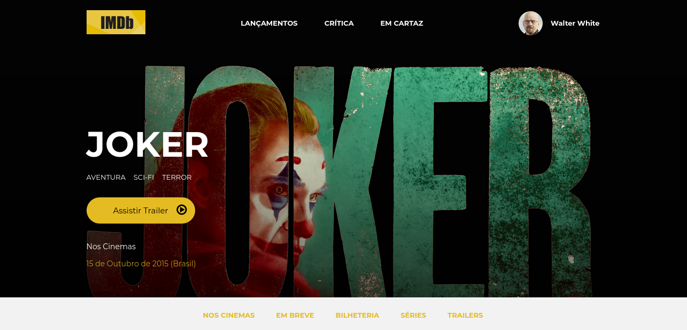

    

<h1 align="center">
  Desafio 01 - IMDB
</h1>

<strong>Objetivo</strong>
    
O desafio é desenvolver a página inicial de um site de avaliação de filmes (IMDB - Internet Movies Database) utilizando apenas HTML5 e CSS3.

    
<strong>Tecnologias</strong>

Esse projeto tem as seguintes tecnologias:

<ul>
<li>Html</li>
<li>Css</li>
</ul>

Feito por mim(Wender Zilo) e aceito sugestões de melhorias.

